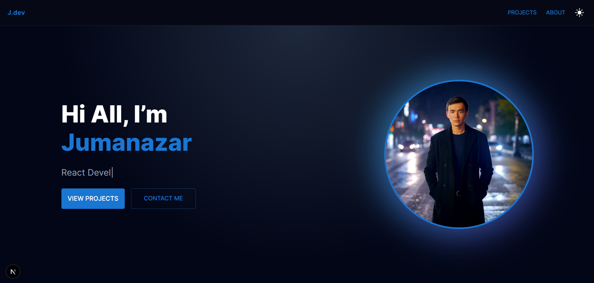
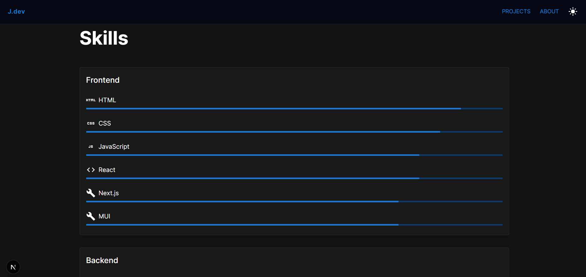

# Personal Portfolio Website

A modern and responsive personal portfolio website built with **Next.js** and **Material UI**.  
This project showcases my skills, projects, and provides a real contact form integrated with Telegram.

---

## 🚀 Tech Stack

- **Next.js** (App Router)
- **React**
- **Material UI (MUI)**
- **Framer Motion**
- **Telegram Bot API**
- JavaScript (ES6+)

---

## ✨ Features

- Responsive and modern UI
- Dark / Light mode support
- Animated sections with Framer Motion
- Skills section with icons and progress levels
- Projects showcase
- About me section
- Contact form with real Telegram bot integration
- SEO optimized (metadata, favicon)
- Deployed-ready for Vercel

---

## 🖥 Live Demo

👉 https://my-portfolio-teal-gamma-75.vercel.app/

---

## 📸 Screenshots

 // Hero.jsx
  // Skills.jsx

